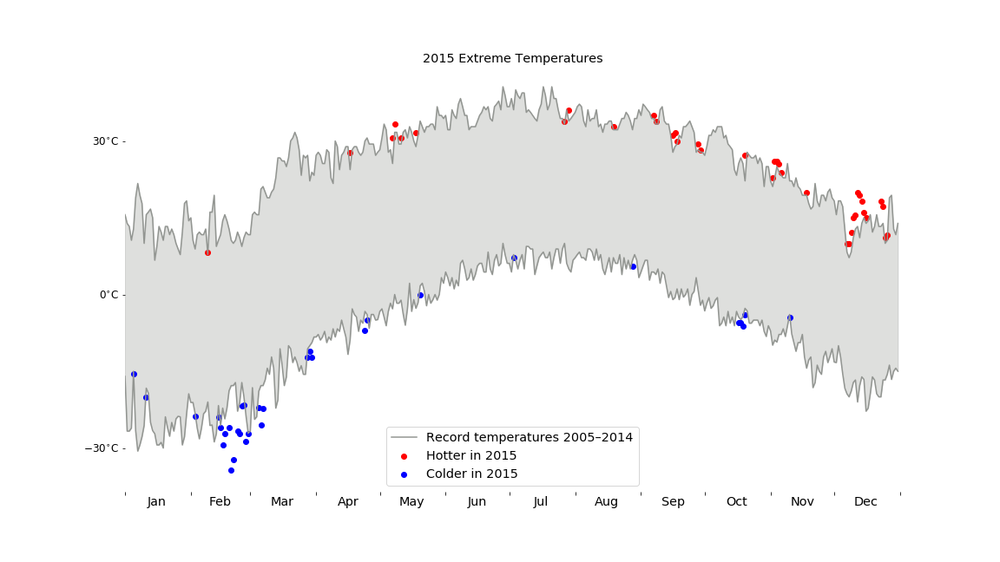
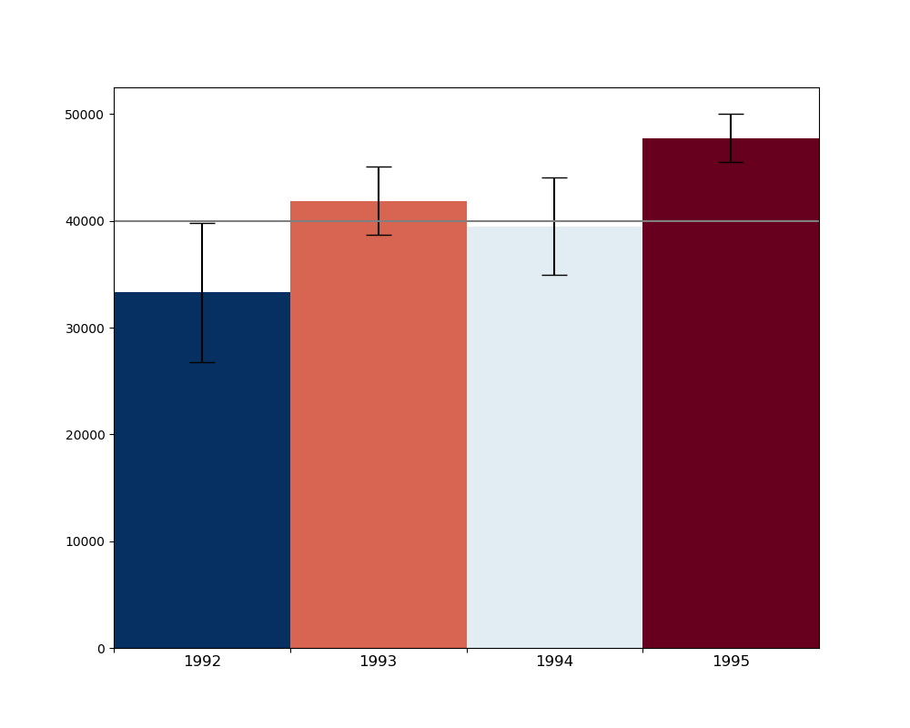

Applied Plotting and Charting in Python
=======================================

In this course I learned principles of data presentation.

## Assignment 2

We prepared a chart of extreme temperatures in 2015, which were higher or lower than the highest or lowest in the prior ten years.

## Assignment 3

This assignment was to prepare a figure according to a paper.

> Ferreira, N., Fisher, D., & Konig, A. C. (2014, April). Sample-oriented task-driven visualizations: allowing users to make better, more confident decisions.
> In Proceedings of the SIGCHI Conference on Human Factors in Computing Systems (pp. 571-580). ACM.
> doi:[10.1145/2556288.2557131](https://doi.org/10.1145/2556288.2557131)

The figure was made from normally-distributed random data. For several sets of this data, we were to plot bar charts according to the means, along with error bars depicting the 95% confidence interval. The colors of the bars were based on a particular specially selected value (more on this value in the next paragraph). Given this value, each bar was to be colored dark blue if the selected value were certainly above the mean, dark red if the selected value certainly below, white if the selected value were equal or almost equal to the mean, and a gradient of those colors for values between those extremes. Here is a sample, with one particular selected value:

As I have described thus far, this plot would have been sufficient for what the assignment calls the "Harder Option". But my code fulfills the "Even Harder Option", which enables interactivity. In a live Jupyter environment, the user can click on the plot to update the currently selected value, which redraws the selected line and recolors all the bars according to the formula.
